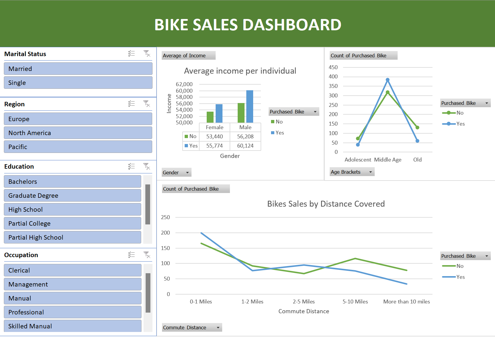

# Bike-Sales-Analytics

In this data analysis report, I will present an overview of my data analysis skills and capabilities through the analysis of a bike sales dataset. The goal of this analysis is to showcase my ability to clean, explore, and visualize data using Excel, as well as derive meaningful insights that can drive decision-making.

## Data Source:
The dataset used for this analysis is titled Bike-sales-analysis.csv. It contains information about bike sales, including customer demographics (age, gender, marital status, education), regional information, and sales amounts.

## Data Cleaning:
The initial dataset required some cleaning, such as removing duplicate entries and ensuring consistent formatting.

## Exploratory Data Analysis
Performed an exploratory analysis to gain a comprehensive understanding of the dataset.
Utilized pivot tables to summarize and aggregate data by different variables, such as age, gender, and region.
Derived insights into customer demographics and their correlation with sales performance.

## Key Findings
- Married individuals tend to have higher average sales compared to single individuals.
- Sales performance varies across different regions, with certain regions consistently outperforming others.
- Graduates and individuals with higher education levels exhibit higher average sales amounts.
- There is a notable difference in purchasing patterns between male and female customers with males having more purchasing power than females.

## Conclusion
Through this data analysis project, I have demonstrated my ability to extract meaningful insights from complex datasets and present them in a visually engaging manner. The developed dashboard showcases my proficiency in data cleaning, exploratory analysis, and data visualization using Excel. These skills enable me to provide actionable insights to inform decision-making and drive business growth.

### Disclaimer
This report is based on the analysis conducted using the provided dataset. The findings and conclusions should be considered in the context of the dataset and specific analysis objectives.
